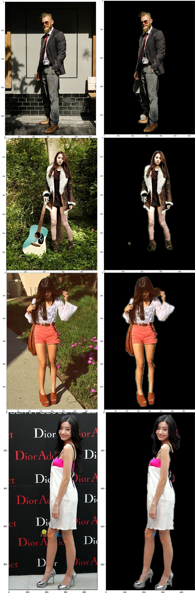

# Human Segmentation
Human segmentation using CNN, U-Net architecture.  

## U-net
[U-Net: Convolutional Networks for Biomedical Image Segmentation](https://arxiv.org/abs/1505.04597)

## Dependencies
+ python = 3.5
+ tensorflow == 1.5.0
+ keras == 2.2.4
+ opencv == 4.2.0.32
+ numpy == 1.14.5
+ scipy == 1.4.1

## Dataset
HumanParsing Dataset https://github.com/lemondan/HumanParsing-Dataset  
Preprocessed Dataset https://www.kaggle.com/kairess/human-segmentation  

## Result

